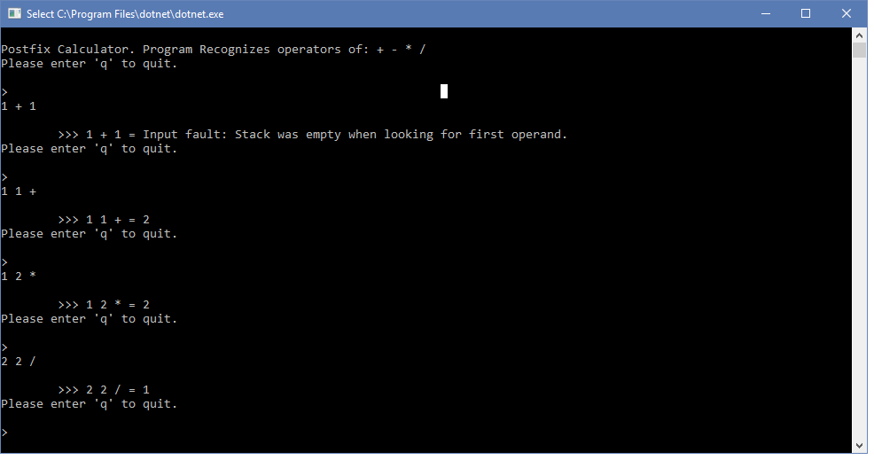
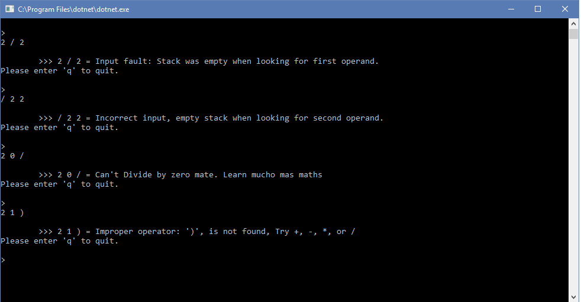

## CS 460 HW 3 Java to C# Post fix conversion

Credits: William Leingang (hope that's how its spelled) and Aaron Earl gave me tips on how to tackle this project when I got stuck. Any code that is similar to theirs is because of using their suggestions and their experience in my program. 

### Conception
To start this project I went through the javacode provided in the [assignment description](http://www.wou.edu/~morses/classes/cs46x/assignments/HW3.html). This is a Post fix calculator.
A post fix calculator takes the two operands 'a' and 'b' and then looks for the operation '+ - * /' for example. It may seem counter intuitive at first but once familiar going through a lot of simple operations goes much faster. 
The goal of this project is to convert the Java code given to a C# code base. A relatively simple task as the two languages are fairly object oriented and a lot of the method calls convert in a 1:1 ratio. The biggest difficulty would be when Java uses the 
```java 
While(x.HasNext()){

}
```
This functionality is not implemented the same in C# and requires a slight work around. In my code a for loop will be used. 

### Class : Main/Calculator
Namespaces is one of the ways that the visual studio and C# environment diferentiate from the Java/Eclipse environment.
```csharp
namespace PostFixCalculator
{
    class Calculator
    {
        /*
         * A post fix calculator designed to be run from user input 
         * A simple tutorial to write C# from java code
         * */

        //Global Stack to hold the operands
        private LinkedStack stack = new LinkedStack();


        //MAIN No expected args in @param
        static void Main(string[] args)
```

For the first parts of the program that is declaring variables and making the bool logic frame to know when the user would like to quit the program is almost exactly the same as Java code.

```csharp
 static void Main(string[] args)
        {
            Calculator app = new Calculator();
            bool playAgain = true;
            Console.WriteLine("\nPostfix Calculator. Program Recognizes operators of: + - * /");
            
            while (playAgain)
            {
                playAgain = app.doCalculation();
            }
            Console.WriteLine("Bye. Tell your Friends");

            //End of main
        }
```
A usefull feature of C# is that when dealing with input we can use Console.Readline() as a simple scanner. This will enter any information of the user has given us on the 'rtrn' or 'entr' keystroke.
A method that is part of Strings is that we can check the first character of any given string by x.StartsWith("a") where 'a' is a desired character to check. 

```csharp
 input = Console.ReadLine(); //getting input from console

            //Check if the user wishes to quit application, keyword q || Q
            if(input.StartsWith("q") || input.StartsWith("Q"))
            {
                return false; //exit this function and cancel while loop in main.
            }
```

Now that we can get input from the user we need to make sure that we have everything we need and that it's in a proper format. 
The first step is to parse the input into 2 doubles and then look for the proper operation. As easy as that sounds, we have to send the information into a stack and then pop each item to make sure we get what we need in the correct order. 

```csharp
 if (input == null || input == "")
            {
                throw new ArgumentException("Null string or empty string was passed into calculator, and is not valid.");
            }

            stack.clear(); //clearing stack of any garbage from previous calcs or random crap.

            String s; // Stores the operator
            double a;     // Temp Variable for first value of input
            double b;
            double c; //answer

            double checker;
            
```
Above we have a statement to check if the input is a null or empty string and will report that back to the user on the command line. This is a method of error checking at the start. 
Next we clear the stack and assign a few variables that will store the input and help with the function of making the logic work properly. The logic steps here are to parse and split the input based upon spaces, and push all the numbers to the stack in a variable until we reach a character that is not a double. It will be assumed that the next character is the operand. 


```csharp

            string[] UserInputs = input.Split(new char[0]); //splits the input string into an array based upon spaces
            //used a separate loop from OG code to help determine all the inputs in C#, while loops aren't my friend
            //loop to travel through all of the inputs given by the user
            for (int i = 0; i < UserInputs.Length; i++)
            {
                if (double.TryParse(UserInputs[i], out checker))
                {
                    stack.Push(Convert.ToDouble(UserInputs[i])); //pushing numbers of type double into the stack
                }
                //couldnt get the information from the user correctly and present the proper error message
                else
                {
                    s = UserInputs[i];
                    //checking for empty stack
                    if (stack.isEmpty())
                    {
                        throw new ArgumentException("Incorrect input, empty stack when looking for second operand.");
                    }

                    b = (Convert.ToDouble(stack.pop()));
                    //operator or character that wasnt expected, post fix is a, b, + where a and b are numbers and + is the operation
                    if (stack.isEmpty())
                         {
                         throw new ArgumentException("Input fault: Stack was empty when looking for first operand.");
                         }

                    a = (Convert.ToDouble(stack.pop()));
                    c = doOperation(a, b, s);

                    stack.Push(Convert.ToDouble(c));

             }
            } //end of loop
            //return the solution to rest of the program
            return stack.pop().ToString(); //given as a string
        }

```
What the above code accomplishes is to push the inputs into the stack, pop and assign a variable, and then pass the variables to another function that will do the arithmetic. Having modularity between the assignment/input gathering and the math allows for a cleaner program that will be easier to read and work on later. Finally in the code below we have the doOperation function that will assume what ever input it is given is in the correct format and ready to turn into an answer. 

```csharp
/*
         * Arithmetic operation kept separate for modularity  
         * */
         public Double doOperation(double a, double b, String s)
        {
            double c = 0.0;
            if(s == "+")
            {
                c = (a + b);
            }
            else if(s == "-")
            {
                c = (a - b);
            }
            else if(s == "*")
            {
                c = (a * b);
            }
            else if(s == "/")
            {
                try
                {
                    c = (a / b);
                    if(c == Double.NegativeInfinity || c == Double.PositiveInfinity)
                    {
                        throw new ArgumentException("Can't Divide by zero mate. Learn mucho mas maths");
                    }
                }
                catch(ArithmeticException e)
                {
                    throw new ArithmeticException(e.ToString());
                }
            }
            else
            {
                throw new ArgumentException("Improper operator: '" + s.ToString() + "', is not found, Try +, -, *, or /");
            }
            return c;
        }
        
    }
}
//End of Class Calculator
```

### Class : LinkedStack
    The linked stack that is defined in the following will implement an interface that we will also define. 
    The common functions of a stack are defined here, namely Push, Pop, Peek, and isEmpty. Using nodes to store the data and act as the link between data points creates very clean and short code for this section. 
    
```csharp
namespace PostFixCalculator
{
    /*
     * A linked stack for use in a postfix calculator, Strongly typed and will implement the interface IStackADT.
     * */
    class LinkedStack : IStackADT
    {
           //Node from separate class as a variable
        private Node top;

        public LinkedStack()
        {
            top = null; //empty stack
        }
```
The constructor will be initialized to create and empty stack. That way we don't have to worry too much about garbage collection in the classical sense of C. 
A node is used as the first instance and wont be fed any data until we initialize within the main. Below in the code we see the Push() method and it is passed a member of the object class. 

```csharp
 public object Push(object newItem)
        {
            if(newItem == null)
            {
                return null;
            }
            Node newNode = new Node(newItem, top);
            top = newNode;
            return newItem;
        }
```
Push will check to see if the param was null and then if it recieves anything will create a new node and link it to the previous and then assign data. The basic structure of a stack starts to form. 
Pop peek and isEmpty work the same way. Use the properties of the node in order to provide the structure and then create classes that tell the node what to do in a few short lines.

```csharp
public object pop()
        {
            if (isEmpty())
            {
                return null;
            }
            object topItem = top.Data;
            top = top.Next;
            return topItem;
        }
        public object peek()
        {
            if (isEmpty())
            {
                return null;
            }
            return top.Data;
        }
        public Boolean isEmpty()
        {
            return top == null;
        }
        public void clear()
        {
            top = null;
        }
```

### Class : IStackADT

The convention for interface naming in C# is to assign the first letter of the interface class I. 
IStackADT is just a standard interface that just has method calls with the params.

```csharp
namespace PostFixCalculator
{
    /*
     *Interface for the stack functionality in LinkedStack.
     * Basic Stack functionality.
     **/

    interface IStackADT
    {

        /*
         *  * Push an item onto the top of the stack. Pushing an object that 
	 * doesn’t exist should result in an error and should not succeed.
	 * Pushing an object that is not an item should result in an error.
	 * This operation returns a reference (pointer or link, but not a copy)
	 * to the item pushed so that an anonymous object can be pushed and then used.
	 * @param newItem The object to push onto the top of the stack.  Should not be null
	 * @return A reference to the object that was pushed, or null if newItem == null
     * 
     * difference between Java and C# is dont declare the scope public
         * */
        object Push(object newItem);

        /**
         * Remove and return the top item on the stack. This operation should 
         * result in an error if the stack is empty. Returns a reference to the 
         * item removed.
         * @return A reference that was popped (and removed) from the stack or null if
         * 			the stack is empty
         */
        object pop();

        /**
 * Return the top item but do not remove it. Generally should result in 
 * an error if the stack is empty. An acceptable alternative is to return 
 * something which the user can use to check to see if the stack was in fact empty.
 * @return A reference to the item currently on the top of the stack or null if
 * 			the stack is empty
 */
        object peek();

        /**
	 * Query the stack to see if it is empty or not. Cannot produce an error.
	 * @return True if the stack is empty, false otherwise
	 */
        bool isEmpty();

        /**
         * Reset the stack by emptying it. The exact technique used to clear 
         * the stack is up to the implementor. The user should pay attention to what 
         * this behavior is.
         */
        void clear();
    }
}
```
Since the commenting is so complete compared to the coding itself it become redundant to state it again outside the code. 

### Class : Node
For the final class of Node we need an object that can store data and store the location of the next node in the list. Having broken the problem down so completely each helper class can be short and simple but have an important task. 

```csharp
namespace PostFixCalculator
{
    /*
     * Node class to hold data and carry it between classes
     * */
    class Node
    {
        object data; //global variables
        Node next; //next node in chain

        //default constructor
        public Node()
        {
            data = null;
            next = null;
        }

        //constructor with 2 params for data and next
        //iData and iNext for input data and input next
        public Node(object iData, Node iNext)
        {
            data = iData;
            next = iNext;
        }

        /*
         * the following code is Aaron Earl's solution to the global variable accessibility issue with the other classes 
         * accessing this class.
         * */

        public object Data { get { return data; } set { data = value; } }

        public Node Next { get { return next; } set { next = value; } }
    }
}
```
In the Node class we have 2 constructors. This will allow us to defaul or pass in what we choose for greater functionality. I needed to borrow Aaron Earl's solution to get the other classes to access the functionality properly. The first part seems like a 1:1 conversion to the java code but the rest of the program did not seem to comply. 

###Screen shots of working program


